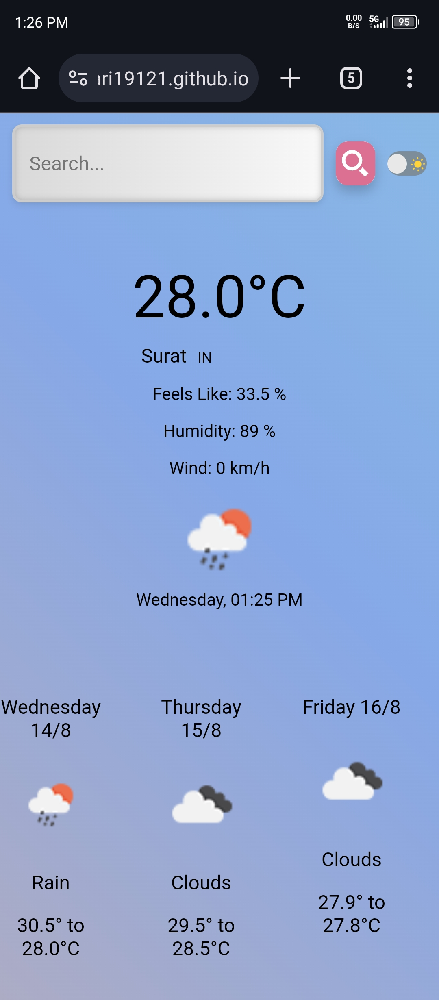
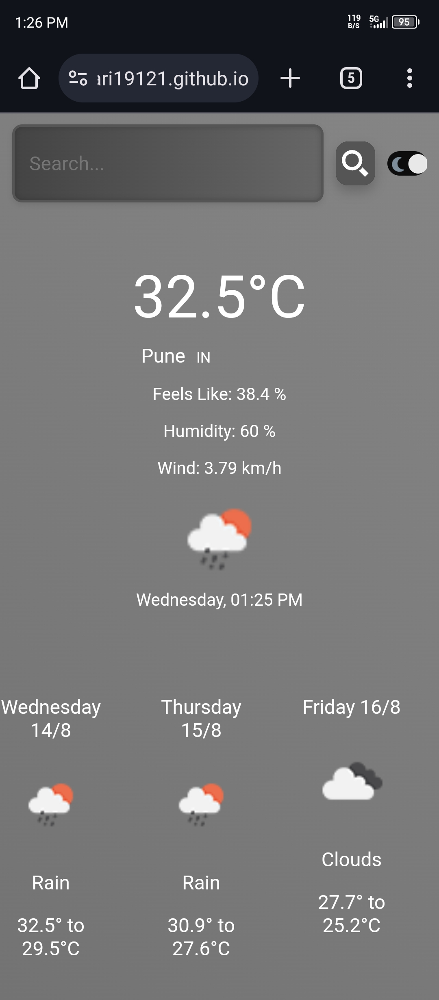
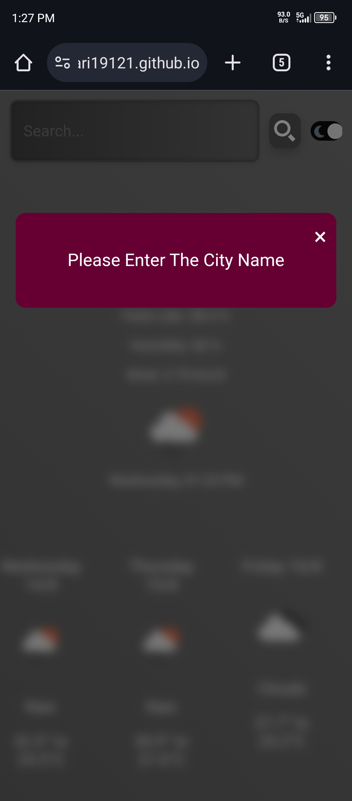

# Weather-Forecast-App

A simple weather forecast app that allows users to search for current weather and 10-day weather reports for any city.

Features

- Search for weather by city name
- Displays current weather conditions
- Shows 10-day weather forecast
- Uses OpenWeather API for data
- Built with HTML, CSS, and JavaScript

Usage

1. Clone the repository or download the code
2. Open the index.html file in a web browser
3. Search for a city by typing its name in the search bar
4. Click the "Search" button to display the weather data

API

This app uses the OpenWeather API to fetch weather data. You can sign up for a free API key on the OpenWeather website.

Acknowledgments

- OpenWeather API for providing weather data

Description

A weather forecast app that allows users to search for current weather and 10-day weather reports for any city. Built with HTML, CSS, and JavaScript, and uses the OpenWeather API for data.

Screenshots

Here is some screenshot

City Search Result: "Screenshot of the search result page after searching for a city, showing surat's data."

Dark Theme: "Screenshot of the website in dark theme mode, showing the same data with a different color scheme."

Please Enter City Modal: "Screenshot of the modal that prompts the user to enter a city name."
